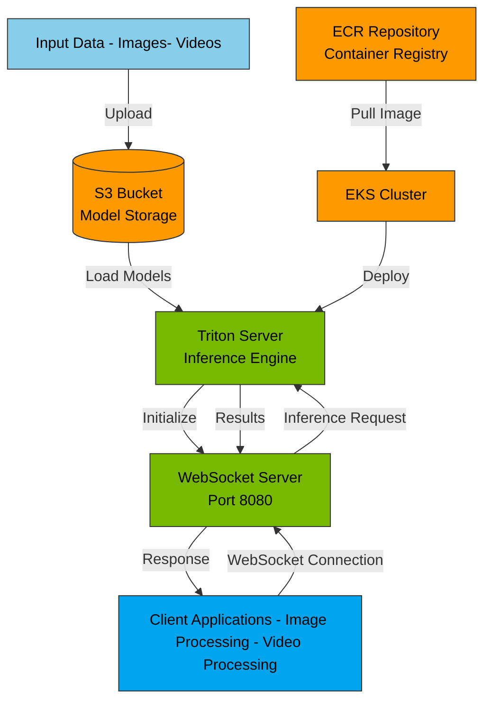

```mermaid
flowchart TD
    classDef awsColor fill:#FF9900,stroke:#232F3E,color:black
    classDef tritonColor fill:#76B900,stroke:#333,color:black
    classDef clientColor fill:#00A4EF,stroke:#333,color:black
    classDef dataColor fill:#87CEEB,stroke:#333,color:black

    S3[("S3 Bucket
Model Storage")]:::awsColor
    ECR["ECR Repository
Container Registry"]:::awsColor
    EKS["EKS Cluster"]:::awsColor
    TS["Triton Server
Inference Engine"]:::tritonColor
    WS["WebSocket Server
Port 8080"]:::tritonColor
    Client["Client Applications - Image Processing - Video Processing"]:::clientColor
    Data["Input Data - Images- Videos"]:::dataColor

    Data -->|"Upload"| S3
    ECR -->|"Pull Image"| EKS
    S3 -->|"Load Models"| TS
    EKS -->|"Deploy"| TS
    TS -->|"Initialize"| WS
    Client -->|"WebSocket Connection"| WS
    WS -->|"Inference Request"| TS
    TS -->|"Results"| WS
    WS -->|"Response"| Client
```
