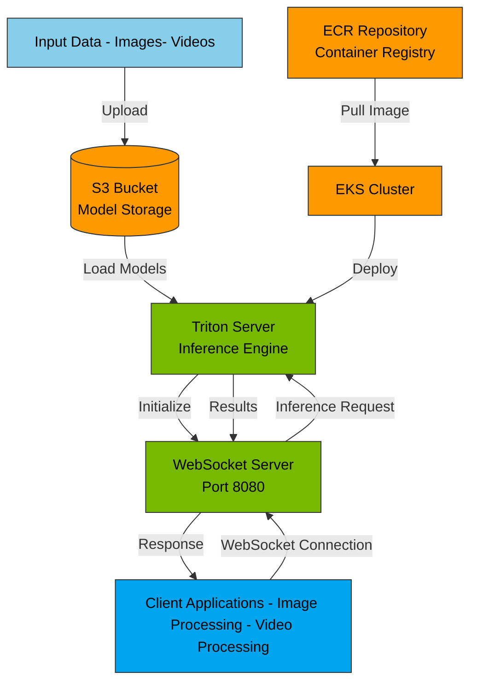

# Triton WebSocket Pipeline Server

A scalable machine learning inference pipeline using NVIDIA Triton Server with WebSocket support deployed on Amazon EKS.

## Architecture

The system implements a WebSocket-based pipeline for ML inference, utilizing AWS services and Triton Server for scalable model serving.

## Prerequisites

- AWS CLI configured
- Docker installed
- kubectl installed
- Terraform installed

## Setup Instructions

### 1. AWS Environment Setup

```bash
# Configure AWS CLI
aws configure

# Create ECR repository
aws ecr create-repository --repository-name websocket-pipeline

# Login to ECR
aws ecr get-login-password --region us-east-1 | docker login --username AWS --password-stdin ${AWS_ACCOUNT_ID}.dkr.ecr.us-east-1.amazonaws.com
```

### 2. Docker Image Build and Push

```bash
# Build image
docker build -t websocket-pipeline .

# Tag and push to ECR
docker tag triton-ws-pipeline ${AWS_ACCOUNT_ID}.dkr.ecr.us-east-1.amazonaws.com/websocket-pipeline:latest
docker push ${AWS_ACCOUNT_ID}.dkr.ecr.us-east-1.amazonaws.com/websocket-pipeline:latest
```

### 3. Model Storage Setup

```bash
# Create S3 bucket
aws s3 mb s3://dry-bean-bucket-c

# Upload models
aws s3 cp models/ s3://dry-bean-bucket-c/models/ --recursive
```

### 4. Infrastructure Deployment

After Terraform deployment, you'll get the following outputs:
- Cluster Endpoint: `https://15DF156C8781098F09C4B799AD43D8.gr7.us-east-1.eks.amazonaws.com`
- Cluster Name: `triton-streaming-cluster`
- VPC CIDR: `192.168.0.0/20`

### 5. Cluster Connection

```bash
aws eks update-kubeconfig --name triton-streaming-cluster --region us-east-1
```

## Service Verification

```bash
# Check nodes
kubectl get nodes

# Verify services
kubectl get svc
```

Expected output:
```
NAME            TYPE           CLUSTER-IP       EXTERNAL-IP                                          PORT(S)
triton-server   LoadBalancer   10.100.206.244   ab2c89d3704f3499e9350563e87f167b-000xxx.elb...     8000:32604/TCP,8001:31757/TCP,8002:31379/TCP,8080:30896/TCP
```

## Testing the Pipeline

### 1. Basic Connection Test
```bash
python3 python/client/simple_test.py
```

### 2. Extended Functionality Test
```bash
python3 python/client/extended_test.py
```

### 3. Inference Testing
```bash
python3 python/client/inference_test.py
```

## Advanced Features

### Parallel Image Processing

The system supports parallel image processing with the following capabilities:
- Concurrent connection handling
- Batch processing
- Result aggregation and CSV export

```bash
python3 parallel_image_processing.py
```

### Video Processing

Supports parallel video processing with:
- Multi-video concurrent processing
- Frame-level parallelization
- Progress tracking and error handling

```bash
python3 parallel_video_processing.py
```

## Performance Monitoring

Server-side monitoring available through:
- HTTP endpoint (port 8000)
- Metrics endpoint (port 8002)
- WebSocket status (port 8080)

## Container Services

The deployment runs multiple services:
- Triton Server (Model Serving)
- WebSocket Server (Client Communication)
- Metrics Server (Monitoring)

## Troubleshooting

To check the server status:
```bash
kubectl exec -it <pod-name> -- /bin/bash
netstat -tuln
```

Expected ports:
- 8080: WebSocket
- 8000: HTTP
- 8001: gRPC
- 8002: Metrics

### For further details:
https://github.com/dochristy/triton-eks-server-streaming/blob/main/triton-eks-ws-server-streaming/k8s/README.md#first-prepare-your-aws-environment
